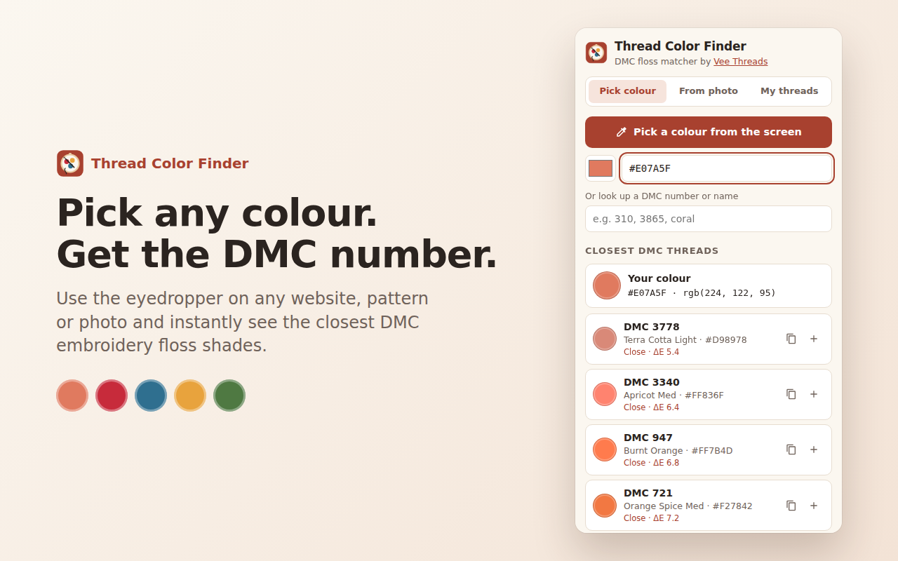

# Thread Color Finder – DMC Floss Matcher by Vee Threads

A Chrome extension for embroiderers. It matches any colour on screen, or any photo, to the closest **DMC embroidery floss** numbers. It is published by [Vee Threads](https://veethreads.com) to earn a Chrome Web Store listing that links back to veethreads.com, and to send embroidery fans to the site.



## Features
- **Eyedropper:** pick a colour anywhere on screen and get the 5 closest DMC threads, ranked by CIEDE2000 ΔE.
- **Photo → palette:** drop, paste or upload an image to get a 2–16 colour DMC palette with how much of the image each colour covers. Images stay on the user's computer.
- **DMC lookup:** search by number or name and see similar shades.
- **Shopping list:** save threads and copy the whole list in one click.
- Only two permissions (`sidePanel`, `storage`). No remote code, no data collection, works offline. This keeps store review fast.

### Where it links to veethreads.com
| Placement | Link |
|---|---|
| Store listing "Official URL" (verified) + Homepage URL | veethreads.com |
| Store description | veethreads.com and /collections/custom-hand-embroidery |
| Manifest `homepage_url` (the "Visit website" link on the extension's details page) | veethreads.com |
| Panel header "by Vee Threads" | veethreads.com |
| "My threads" tab call-to-action | /collections/custom-hand-embroidery |
| Panel footer | veethreads.com |

Every in-extension link is tagged `utm_source=chrome-extension&utm_campaign=thread-color-finder`. You can track the visits in GA4 or Shopify Analytics.

## Project layout
```
extension/          the extension itself (this folder gets zipped)
  manifest.json     MV3 manifest
  background.js     opens the side panel on toolbar click
  panel.html/css/js side panel UI
  lib/color.js      sRGB→Lab, CIEDE2000, DMC matching, k-means palette extraction
  data/dmc.js       454 DMC floss colours
store/              listing copy, privacy policy, screenshots, promo tiles
release/            ready-to-upload zip
scripts/            test, icon, screenshot and zip scripts
```

## Develop & test
```sh
npm install
npm test             # loads the real extension in Chromium and runs end-to-end checks
npm run icons        # re-render icons from store/src/icon.svg
npm run screenshots  # re-render store screenshots & promo tiles
npm run zip          # build release/thread-color-finder-v<version>.zip
```
To try it yourself: open `chrome://extensions`, turn on **Developer mode**, click **Load unpacked**, select the `extension/` folder, then click the toolbar icon.

## Publish it (about 30 minutes of your time, then 1–7 days of review)

1. **Verify veethreads.com in Google Search Console** (https://search.google.com/search-console) using the Google account you'll publish with. Shopify supports the HTML-tag method: Online Store → Themes → Edit code → `theme.liquid`, and paste the tag inside `<head>`.
2. **Create two Shopify pages** (Online Store → Pages):
   - `thread-color-finder-privacy`: paste `store/privacy-policy.md`.
   - `thread-color-finder`: a landing page for the extension (suggested copy below). This gives the store a relevant page to link to, and gives bloggers something to link to as well.
3. **Register as a Chrome Web Store developer** at https://chrome.google.com/webstore/devconsole. There is a one-time US$5 fee, and you need to verify your contact email.
4. **New item → upload** `release/thread-color-finder-v1.0.0.zip`.
5. **Fill in each tab** by copying from [`store/listing.md`](store/listing.md): store listing, graphics, privacy practices and distribution. For **Official URL**, pick veethreads.com (it appears once step 1 is done).
6. **Submit for review.** Once it's approved, add the store link to your website footer and to the landing page.

### Suggested landing page copy (`/pages/thread-color-finder`)
> **Free Thread Color Finder for Chrome**
> Match any colour on your screen, or any photo, to the closest DMC embroidery floss. It's made by the artisans at Vee Threads for fellow stitchers.
> [Add to Chrome – it's free](https://chromewebstore.google.com/detail/YOUR-EXTENSION-ID)
> • Eyedropper → DMC number in one click • Photo → thread palette • Save a thread shopping list
> Would rather have it stitched for you? [Explore custom hand embroidery →](https://veethreads.com/collections/custom-hand-embroidery)

## Getting more from the backlink
The Chrome Web Store link is a trusted, relevant mention of your site, but Google usually marks these links nofollow. Most of the SEO value comes from the **extension as linkable content**:
- Post it to r/Embroidery, r/CrossStitch and r/crafts. Show a real use, such as matching a Pinterest photo to DMC threads; don't just drop the link.
- Pitch embroidery and cross-stitch bloggers who write "best tools for embroiderers" or "DMC colour chart" posts. Ask them to link to your landing page (followed links to veethreads.com) rather than the store page.
- Submit it to Product Hunt and to extension directories such as alternativeto.net.
- Link the landing page from your blog posts and your Instagram bio, and mention it in pinned Pinterest pins.

## Credits
The DMC RGB values come from the public "DMC Cotton Floss converted to RGB Values" table (via [adrianj/CrossStitchCreator](https://github.com/adrianj/CrossStitchCreator)). Screen colours approximate real thread. DMC is a trademark of DMC Corporation, and this project is not affiliated with DMC.
