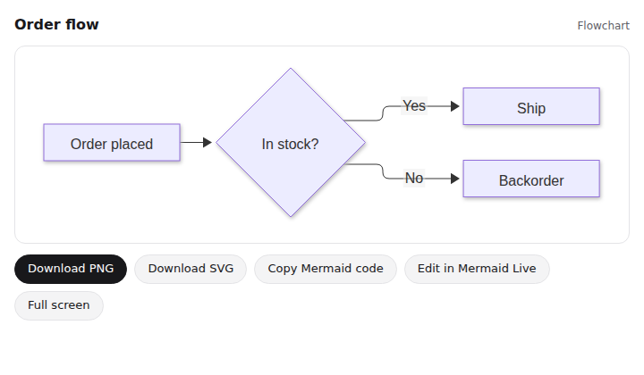
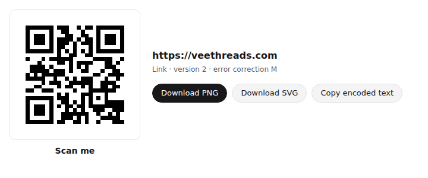

# ChatGPT Plugins: Research Papers, Diagrams and QR Code Generator

Three ChatGPT plugins, picked for proven demand and real usefulness, served by one small Node server.

| Plugin | What it does in ChatGPT | MCP endpoint |
|---|---|---|
| **Research Papers** | Searches 250M+ scholarly works and returns real papers with DOIs, abstracts, citation counts and free full-text links. Formats reference lists in APA, MLA, Chicago, Harvard, IEEE or BibTeX. | `/research/mcp` |
| **Diagrams** | Draws flowcharts, mind maps, sequence diagrams, Gantt charts, timelines, ER diagrams and more inside the chat. Exports PNG/SVG, opens in Mermaid Live, and offers one-click "fix it" on syntax errors. | `/diagrams/mcp` |
| **QR Code Generator** | Makes QR codes that actually scan, for links, Wi-Fi, contact cards, email, SMS, phone and location. Supports a caption and colours, with PNG/SVG download. | `/qr/mcp` |




## Why these three

Since July 2026, ChatGPT's **Plugin Directory** (it replaced the App Directory) lists plugins that bundle MCP apps and skills. Custom GPTs are being retired into plugins. So the usage data from GPTs and from the original 2023 plugins is the best guide to what people use most. Each high-demand category was scored on one question: does a plugin add something ChatGPT can't already do itself? OpenAI's review rejects plugins that only repeat built-in features.

| Demand category | Evidence of demand | Built into ChatGPT? | Decision |
|---|---|---|---|
| Academic research & citations (Scholar GPT, Consensus, ScholarAI) | Scholar GPT 19M+ conversations, Consensus 8M+. ScholarAI was a top 2023 plugin. | Partly: it can browse, but often invents references | **Built: Research Papers** |
| Diagrams (Diagrams: Show Me, Whimsical) | "Show Me Diagrams" was the most-used diagram plugin of the 2023 store | No: it only prints Mermaid code | **Built: Diagrams** |
| QR codes | Evergreen utility request | No: generated images of QR codes don't scan | **Built: QR Code Generator** |
| Writing (Write For Me, AI Humanizer) | 30M+ / 6M+ conversations | Yes | Skipped: duplicates ChatGPT. "Humanizers" exist to evade AI detection, so they're a likely rejection |
| Image generation | 12M+ conversations | Yes | Skipped |
| YouTube/video summaries (Video AI, VoxScript) | 7M+ conversations | No | Skipped for now: YouTube blocks transcript fetching from servers, so it would break often |
| Chat with PDF (AskYourPDF, AI PDF) | 3M+ conversations | Yes (file upload) | Skipped |
| Coding (Code Copilot) / web reading (WebPilot) | 4M+ / top 2023 plugin | Yes | Skipped |
| Design (Canva) | Top-rated directory app (88/100) | Big brands own this | Skipped |

The paid keyword tools connected to this session were out of credits (Semrush API units, OpenSEO credits), and the Ahrefs plan doesn't include keyword data. The ranking above therefore uses public usage numbers rather than Google search volumes. Run a keyword tool on "chatgpt citation", "chatgpt diagram" and "qr code generator" before you write listing copy.

Sources: [GPT Store rankings](https://gptstore.ai/gpts/rank), [top GPTs by conversations](https://community.openai.com/t/ranking-of-top-500-gpts-by-conversations/578607), [ChatGPT directory scores](https://chatgptappsrank.com/state-of-chatgpt-apps-2026), [best ChatGPT plugins for research](https://askyourpdf.com/blog/the-best-chatgpt-plugins-for-research), [App submissions open](https://openai.com/index/developers-can-now-submit-apps-to-chatgpt/), [Plugin Directory replaced apps](https://www.dragapp.com/blog/what-happened-to-chatgpt-plugins/), [OpenAlex API keys](https://groups.google.com/g/openalex-users/c/rI1GIAySpVQ).

## How it works

```
server.mjs                 one HTTP server, three MCP endpoints (2026 MCP spec + 2025 fallback)
src/research/              OpenAlex client, citation formatters, search_papers / get_paper / format_citations
src/diagrams/              render_diagram tool and Mermaid checks
src/qr/                    create_qr_code tool and payload encoders (Wi-Fi, vCard, mailto, SMSTO, geo)
src/widget.mjs             builds widget HTML with the MCP Apps SDK inlined
widgets/                   the in-chat UIs (MCP Apps views): diagram.html, qr.html + shared base.css/base.js
plugins/<name>/            what you submit: .codex-plugin/plugin.json, .mcp.json, skills/, assets/
legal/                     privacy policy and terms (also served at /privacy and /terms)
scripts/test.mjs           end-to-end tests: real MCP calls, QR decoding, widgets rendered in Chromium
```

- Tools are standard MCP. The widgets use the **MCP Apps** standard (`_meta.ui.resourceUri`, `text/html;profile=mcp-app`), which ChatGPT supports. The same server also works in Claude, VS Code and other MCP Apps hosts.
- Widgets get large data (QR SVG/PNG) through the result's `_meta`, so it stays out of the model's context.
- Nothing is stored. Research results are cached in memory for an hour to save OpenAlex credits.

## Develop and test

```sh
cd chatgpt-plugins
npm install
npm test        # end-to-end checks; also refreshes the listing screenshots
npm start       # http://localhost:8787
node scripts/render-logos.mjs   # re-render logo.png / icon-64.png from logo.svg
```

The tests use recorded OpenAlex records (`test/fixtures/openalex.mjs`), because the build sandbox can't reach api.openalex.org. Try one live search after you deploy.

## Deploy

Any Node 20+ host works (Render, Railway, Fly.io, Cloud Run, a VPS). A `Dockerfile` is included.

| Env var | Value |
|---|---|
| `PUBLIC_URL` | Your public https URL, e.g. `https://plugins.veethreads.com`. Widgets load the Mermaid renderer from it. |
| `OPENALEX_API_KEY` | Free key from https://openalex.org/settings/api. Required since Feb 2026: without it OpenAlex allows 100 calls a day. With it you get 100k credits a day. |
| `PORT` | Defaults to 8787 |

Check it: `https://YOUR-URL/health` returns `{"ok":true}`.

Then point the plugin packages at it:

```sh
node scripts/set-url.mjs https://plugins.veethreads.com
```

## Try it in ChatGPT

1. In ChatGPT, turn on **Developer mode** (Settings → Apps → Advanced settings at the time of writing; OpenAI renames these menus often). It needs a paid plan.
2. **Create app**, give it a name and paste the MCP URL, e.g. `https://YOUR-URL/diagrams/mcp`, with no authentication.
3. In a new chat, pick the app from the + menu and try the sample prompts in `LISTING.md`.

## Publish to the Plugin Directory

1. **Host the legal pages.** Create Shopify pages `chatgpt-plugins-privacy` and `chatgpt-plugins-terms` from `legal/`, so the URLs in the manifests resolve. They're also served at `/privacy` and `/terms`.
2. **Verify your organization** in the OpenAI Platform dashboard (developer identity and website `veethreads.com`).
3. **Create one app per plugin** in the dashboard with its MCP URL, icon (`assets/icon-64.png`, under 5 KB), descriptions and screenshots. Copy everything from `LISTING.md`. Run the review test prompts it lists.
4. **Add the app id to the plugin.** Each app gets an id (`asdk_app_…`). Add it as `plugins/<name>/.app.json`, the same layout published plugins such as Supabase's use:
   ```json
   { "apps": { "diagrams": { "id": "asdk_app_..." } } }
   ```
   and add `"apps": "./.app.json"` to that plugin's `.codex-plugin/plugin.json`.
5. **Submit each plugin** (`plugins/research-papers`, `plugins/diagrams`, `plugins/qr-code`) for review.

The manifests list **Vee Threads** as the developer, with veethreads.com URLs. Change `author`, `developerName` and the URLs in `plugins/*/.codex-plugin/plugin.json` if you publish under another name.

## Credits

Paper data: [OpenAlex](https://openalex.org) (CC0). Diagrams: [Mermaid](https://mermaid.js.org) (MIT). QR encoding: [node-qrcode](https://github.com/soldair/node-qrcode) (MIT). Widgets: [MCP Apps SDK](https://github.com/modelcontextprotocol/ext-apps) (Apache-2.0).
